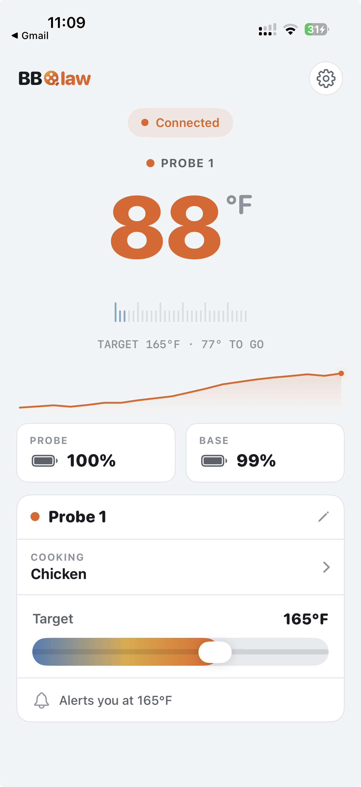

<p align="center">
  
</p>

<h1 align="center">BBQlaw</h1>

A free, fully-local iOS app for cheap BLE meat thermometers (INT-11I-B class).
Your iPhone talks straight to the probe over Bluetooth — **no account, no cloud,
no vendor app.** Connect, watch the temperature, get pinged when it hits target.

**The probe I used:** [this INT-11I-B on Temu](https://share.temu.com/sdv124AbN4A) (~$15). Any INT-11I-B-class probe should work.

> Status: working on real hardware — polishing toward TestFlight.

<p align="center">
  
</p>

## What it does

- Live food temperature, big and glanceable — °F/°C, alerts in the background.
- Multiple probes at once, each with its own target, name, and cook preset.
- Arms the thermometer's **own base-station buzzer** at your target.
- Optional **OpenClaw bridge** — forward the cook to your own AI agent. Your phone
  stays the Bluetooth bridge; the reading never touches anyone else's account.

We reverse-engineered the BLE protocol ourselves (auth handshake, temperature
decode, and the device-control commands), so the stock app isn't needed at all.

## Build

Needs Xcode + [XcodeGen](https://github.com/yonaskolb/XcodeGen) (`brew install xcodegen`):

```bash
xcodegen generate      # regenerate BBQlaw.xcodeproj from project.yml
open BBQlaw.xcodeproj   # run on a real iPhone — BLE doesn't work in the Simulator
```

## Roadmap

- **More thermometers — without app-store updates.** BBQlaw speaks one protocol
  today (INT-11I-B). Open-sourcing it is how we get to many. The plan: a
  pass-through driver model (React Native-style). The native app owns the BLE
  plumbing and the UI; each thermometer is a small **adapter** — declarative where
  it can be (service/characteristic UUIDs, decode rules, command frames), with a
  little JS (via JavaScriptCore) where it needs real logic, like a CRC or an auth
  handshake. Adapters load over the air, so a new probe ships as an adapter, not a
  new build. **Want yours supported? Sniff its BLE, write an adapter, open a PR.**
- TestFlight → App Store (free).
- Cook history + graph.

## Contribute

Open and free — issues and PRs very welcome. The code is the documentation; start
in `BBQlaw/ThermometerManager.swift` (BLE) and `BBQlaw/ContentView.swift` (UI).
Brand + design tokens live in [`DESIGN.md`](DESIGN.md).

Hardware note: the INT-11I-B is food-temp only (no ambient/pit sensor), so there's
no grill temperature to show.

---

BBQlaw is an independent project. Not affiliated with, endorsed by, or sponsored by
any thermometer manufacturer.
